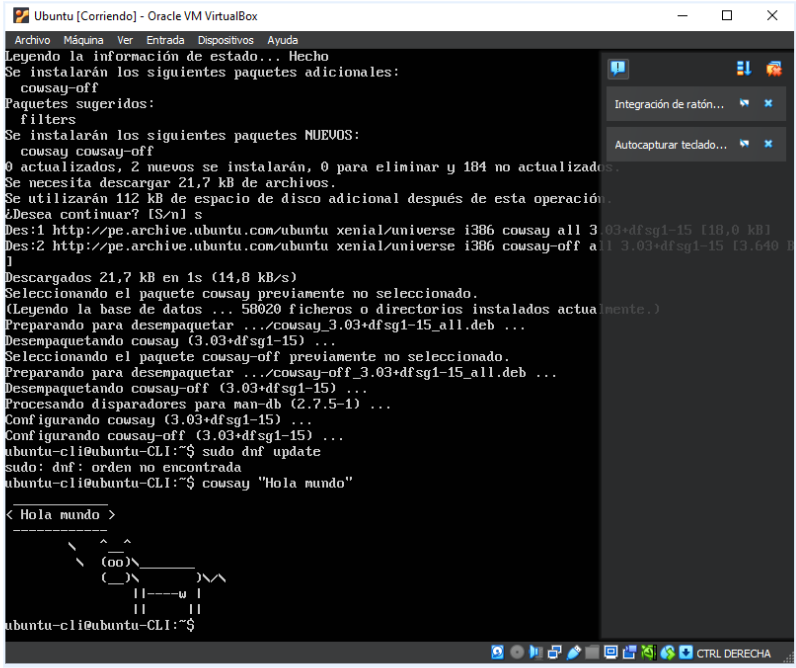
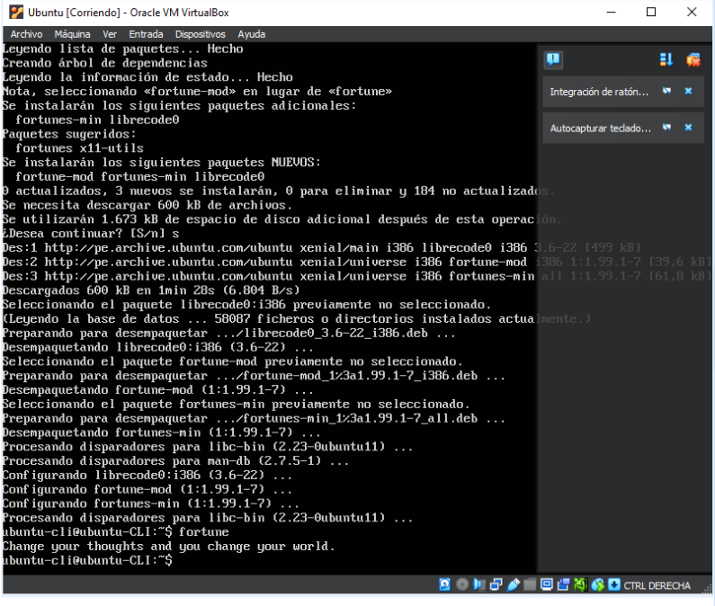
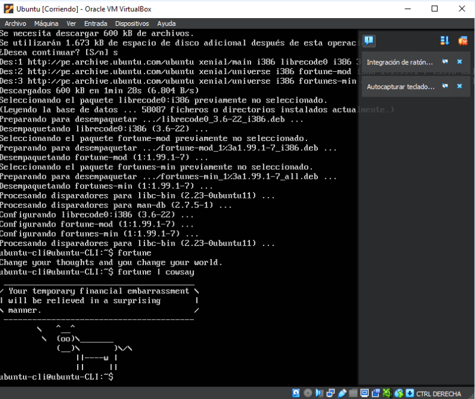

## Usuario root en Linux

En Linux, el usuario root es el superusuario o administrador del sistema. Es el usuario con los más altos privilegios y tiene acceso completo y control total sobre el sistema operativo. El nombre "root" proviene de la raíz del árbol de directorios en el sistema de archivos de Unix/Linux.

## Contraseña de root en Ubuntu durante la instalación

En las versiones más recientes de Ubuntu, el proceso de instalación predeterminado no solicita la creación de una contraseña para la cuenta de root durante la instalación. En su lugar, se utiliza el mecanismo de autenticación basado en "sudo", donde se le otorgan privilegios administrativos temporales a un usuario regular a través del comando "sudo". Esto mejora la seguridad del sistema y evita el uso directo de la cuenta de root.

## Procesos típicos de Linux y cómo identificarlos

Algunos procesos típicos en Linux son:

1. Init (PID 1): Es el primer proceso que se ejecuta durante el arranque del sistema y es responsable de iniciar y detener otros procesos.
2. Bash (o shell): Es el intérprete de comandos que permite a los usuarios interactuar con el sistema operativo. Hay varios shells disponibles en Linux, como Bash, Zsh, Fish, entre otros.
3. Xorg (o Wayland): Estos son los servidores gráficos utilizados en Linux para manejar la interfaz gráfica de usuario. Xorg es el más común, aunque Wayland se está volviendo más popular.
4. Apache (httpd) o Nginx: Son servidores web populares en Linux. Estos procesos permiten que el sistema sirva páginas web y procese solicitudes HTTP.

Puedes identificar los procesos en ejecución en tu sistema utilizando comandos como `ps`, `top`, `htop` o `pgrep`.

## Establecer una contraseña para el usuario root en Linux

Sigue estos pasos para establecer una contraseña para el usuario root:

1. Abre la Terminal (Ctrl + Alt + T).
2. Escribe el siguiente comando y presiona Enter: `sudo su`.
3. Introduce tu clave actual cuando se te solicite.
4. Teclea el siguiente comando y escribe tu nueva contraseña cuando se te solicite: `passwd root`.
5. Presiona Enter y cierra la terminal.

## Subir un documento individual a la mochila

Para subir un documento individual a la mochila, sigue las instrucciones proporcionadas por la plataforma o servicio que estés utilizando.

### Opcional:

Si deseas realizar acciones adicionales, puedes ejecutar los siguientes comandos en la terminal:

- Para instalar "cowsay", escribe: `sudo apt install cowsay`.
- Para que el programa "cowsay" muestre el mensaje "Hola mundo", escribe: `cowsay "Hola mundo"`.
- Para instalar "fortune", escribe: `sudo apt install fortune`.
- Para mostrar una cita aleatoria, escribe: `fortune`.
- Para combinar "fortune" y "cowsay", escribe: `fortune | cowsay`.

## Imágenes

